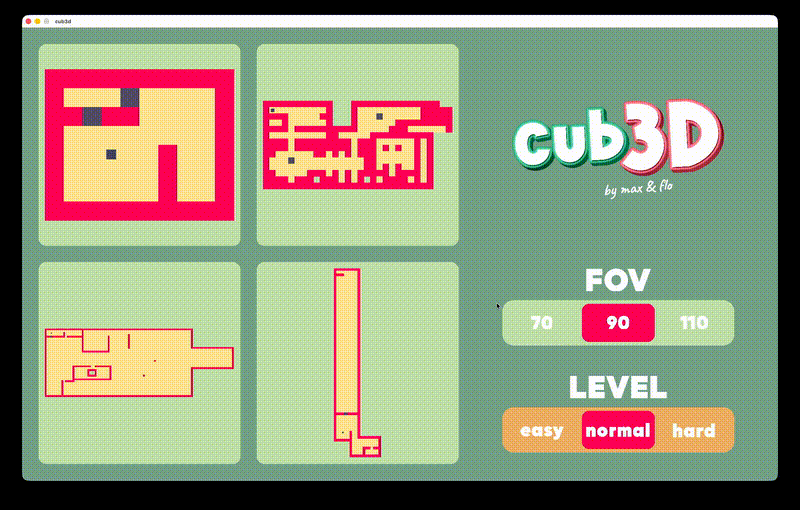
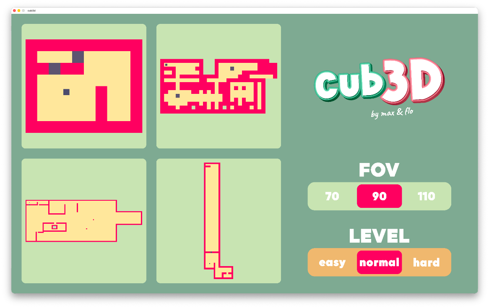
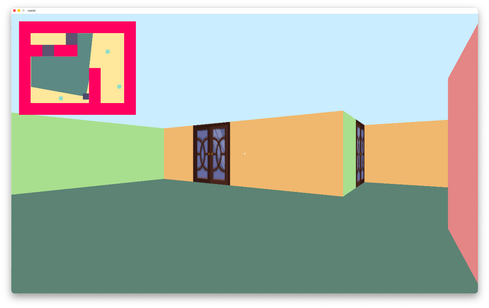
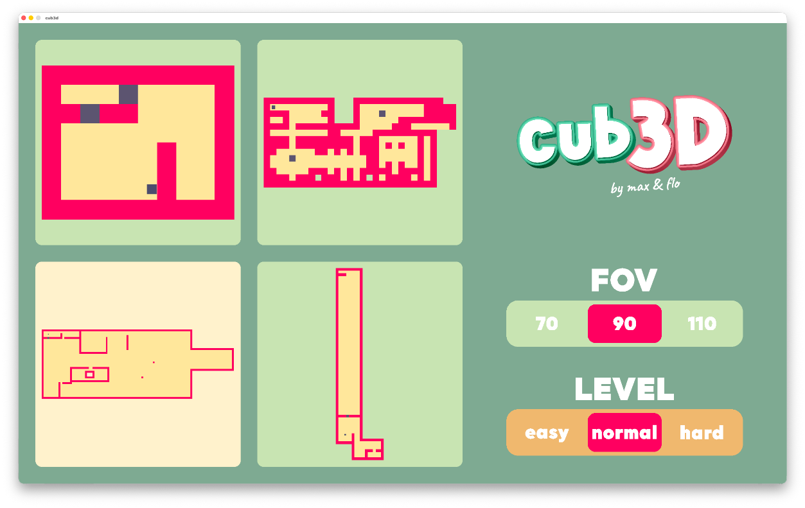
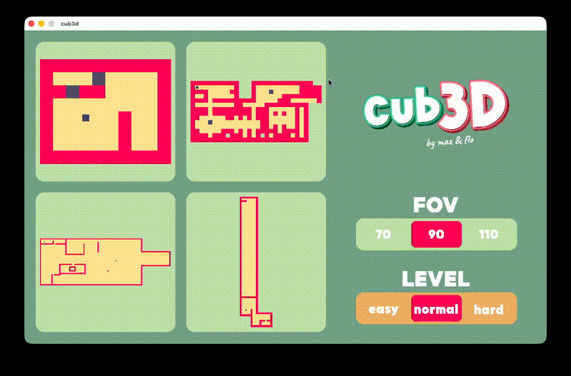

# cub3D

`cub3D` is a 3D raycasting engine built in C with MiniLibX. It renders a first-person maze from a 2D map, handles textured walls, sprites, doors, a minimap, and an in-game menu to switch maps and gameplay options.



## Features

- First-person raycasting renderer
- Textured walls and animated doors
- Sprites and minimap rendering
- In-game menu with map selection
- FOV selection and difficulty/level selection
- Mouse and keyboard controls
- Support for loading a single map file or a whole directory of maps

## Requirements

- A C compiler
- `make`
- MiniLibX dependencies for your platform

The provided Makefile builds the correct MiniLibX backend for Linux or macOS automatically.

## Build

```bash
make
```

Other useful targets:

```bash
make run
make clean
make fclean
make re
```

## Usage

Run the program with a `.cub` file or a directory containing maps:

```bash
./cub3D path/to/map.cub
./cub3D path/to/maps_directory
```

If no argument is provided, the game looks for maps in `./MAPS`.

## Map format

Maps use the `.cub` extension and must define:

- `NO`, `SO`, `WE`, `EA` for wall textures
- `DO` for doors
- `F` for floor color
- `C` for ceiling color

The map itself may contain:

- `1` for walls
- `0` for floor
- `2` for sprites
- `D` for closed doors
- `N`, `S`, `E`, `W` for the player start and direction
- spaces for empty/non-playable cells

The map must be closed and contain exactly one player.

## Controls

| Key / Action | Effect |
| --- | --- |
| `W` / `A` / `S` / `D` | Move forward, left, backward, right |
| `Left` / `Right` arrows | Rotate view |
| `Shift` | Sprint |
| `E` | Open or close a nearby door |
| `Q` | Change map |
| `Tab` | Open or close the menu |
| `Esc` | Quit |
| Left click on the minimap area | Toggle the menu |
| Mouse drag | Rotate the camera |

In the menu, you can select a map with the number keys or by clicking it, and choose FOV and level options with the sliders.

## Screenshots and demos

### Images







### GIF demos




## Project structure

- `main.c` starts parsing, initializes the game, and launches the MLX loop
- `SRCS/PARSING/` handles map loading and validation
- `SRCS/PLAYER/` manages movement, rotation, and direction
- `SRCS/raycasting.c`, `SRCS/rays.c`, and `SRCS/DRAW/` handle 3D rendering
- `SRCS/MENU/` implements the menu, sliders, and animations
- `UTILS/` contains shared helpers, list management, math, file, and string utilities

## 👥 Authors
- [fguirama](https://github.com/Florian1215) (Florian Guiramand)
- [mfinette](https://github.com/mfinette) (Maxime Finette)
